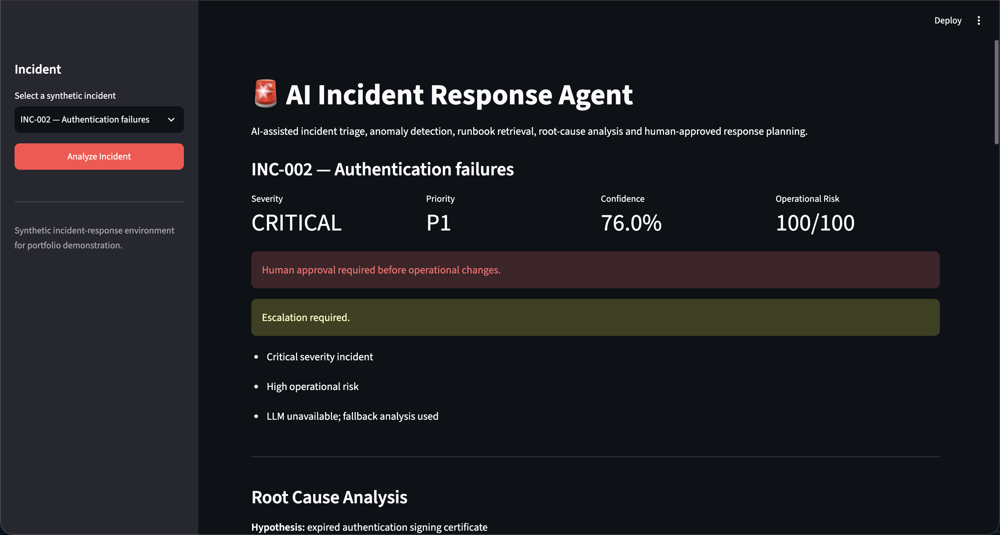
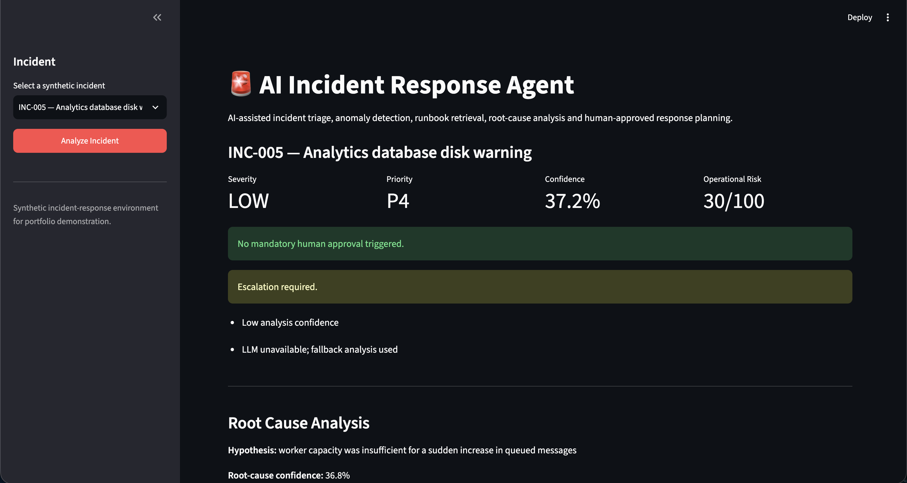

# AI Incident Response Agent

An end-to-end AI-assisted incident response system for triage, anomaly detection, semantic runbook retrieval, historical incident matching, root-cause analysis, operational risk assessment, escalation and human-approved response planning.

## Live Demo

https://mk7xvbwqcdv5up5acwg7df.streamlit.app/

## Overview

The system simulates an AI incident-response assistant for modern software infrastructure.

Pipeline:

Incident Logs  
↓  
Normalization  
↓  
Severity Triage  
↓  
Anomaly Detection  
↓  
Runbook Retrieval  
↓  
Historical Incident Retrieval  
↓  
Root-Cause Analysis  
↓  
Action Planning  
↓  
Confidence Assessment  
↓  
Operational Risk  
↓  
Escalation  
↓  
Human Approval

The project is designed as an advanced AI engineering portfolio system rather than a production autonomous remediation platform.

## Key Features

- Structured log ingestion
- Incident normalization
- Explainable severity classification
- Priority assignment from P1 to P4
- Metric-based anomaly detection
- Log-pattern anomaly detection
- Semantic runbook retrieval
- Historical incident retrieval
- FAISS vector search
- Sentence Transformer embeddings
- Root-cause hypothesis generation
- Historical fallback when an LLM is unavailable
- Structured response planning
- Confidence scoring
- Operational risk scoring
- Escalation logic
- Human approval gate
- Streamlit dashboard
- Automated evaluation
- Automated tests

## Synthetic Incident Dataset

The project contains eight synthetic incidents covering:

- database connection pool exhaustion
- authentication certificate expiration
- worker queue backlog
- external payment provider degradation
- disk utilization growth
- memory pressure
- cache failures
- faulty application deployments

The data is synthetic and contains no real customer or company information.

## Incident Triage

Each incident is classified into:

- Low
- Medium
- High
- Critical

The system then maps severity to operational priority:

- P1 — immediate response
- P2 — urgent investigation
- P3 — investigation required
- P4 — monitor and review

Severity decisions are accompanied by explainable reasons.

## Anomaly Detection

The anomaly engine evaluates both metrics and log patterns.

Examples include:

- elevated request latency
- connection pool saturation
- authentication failure spikes
- queue backlog
- external provider latency
- elevated retry rate
- disk utilization
- memory pressure
- HTTP 500 spikes
- service failure spikes
- expired certificates
- out-of-memory events
- dependency connection failures

## Semantic Runbook Retrieval

The project uses Sentence Transformers and FAISS to retrieve operational runbooks relevant to the current incident.

Runbooks cover areas such as:

- database connection saturation
- authentication certificate failure
- queue backlog
- external provider degradation
- resource pressure
- application failure after deployment

## Historical Incident Retrieval

Current incidents are embedded and compared against previously resolved synthetic incidents.

The retrieved cases provide:

- historical root causes
- previous resolutions
- semantic similarity scores
- supporting evidence for root-cause analysis

Historical similarity is treated as evidence rather than proof.

## Root-Cause Analysis

The root-cause engine combines:

- observed logs
- detected anomalies
- severity signals
- retrieved runbooks
- similar historical incidents

When the OpenAI API is available, the system can use a grounded LLM analysis.

When the API is unavailable, has no credits, or fails, the system automatically degrades to a historical retrieval fallback instead of breaking.

Example:

Incident:

Authentication failures

Root cause:

Expired authentication signing certificate

## Action Planning

The response planner separates recommendations into:

- Immediate Actions
- Investigation
- Recovery
- Verification

The system does not automatically execute operational changes.

Actions are recommendations requiring human oversight.

## Confidence

Analysis confidence combines:

- root-cause confidence
- historical incident similarity
- runbook similarity

Low confidence can trigger escalation.

## Operational Risk

Operational risk considers:

- incident severity
- proposed operational actions
- potentially disruptive actions such as restart, rollback, failover, certificate rotation and scaling

Risk is represented as:

- Low
- Medium
- High

## Human Approval Gate

Operational changes can require explicit human approval.

Approval is required for higher-risk incidents or actions.

Critical incidents are escalated automatically.

The system is intentionally decision-support software rather than an autonomous remediation system.

## Evaluation

The project includes a deterministic evaluation suite.

Current results:

- Severity accuracy: 8/8 — 100%
- Runbook Top-1 retrieval: 8/8 — 100%
- Historical incident Top-1 retrieval: 7/7 — 100%
- Root causes with retrieved support: 8/8
- System evaluation: PASS

The historical retrieval benchmark contains seven evaluated incidents because INC-005 intentionally has no equivalent historical case.

These results represent a small project-specific synthetic benchmark and should not be interpreted as production performance.

Run:

python scripts/evaluate_system.py

## Automated Tests

Current automated test result:

19 passed

The tests cover:

- log ingestion
- normalization
- severity classification
- anomaly detection
- runbook retrieval
- historical retrieval
- root-cause fallback
- action planning fallback
- operational risk
- escalation
- human approval

Run:

pytest -q

## Application Screenshots

### Critical Incident

### Low-Risk Incident

## Architecture

The system follows a modular incident-response pipeline:

Incident Logs and Metrics  
→ Normalization  
→ Severity Triage + Anomaly Detection  
→ Semantic Runbook Retrieval  
→ Historical Incident Retrieval  
→ Root-Cause Analysis  
→ Action Planning  
→ Confidence + Operational Risk  
→ Human Approval or Recommended Response

The architecture deliberately separates deterministic operational logic from semantic retrieval and optional LLM analysis.

Core modules:

- `src/models.py` — structured incident models
- `src/log_ingestion.py` — loading and normalization
- `src/triage.py` — severity and priority classification
- `src/anomaly_detection.py` — metric and log anomaly detection
- `src/retrieval.py` — semantic runbook and historical retrieval
- `src/root_cause.py` — root-cause analysis
- `src/action_planner.py` — response planning
- `src/risk.py` — confidence and operational risk
- `src/pipeline.py` — end-to-end orchestration
- `app/app.py` — Streamlit dashboard
- `scripts/generate_incidents.py` — synthetic incident generation
- `scripts/evaluate_system.py` — evaluation suite
- `tests/` — automated tests

## Design Decisions and Trade-offs

The system combines deterministic logic, semantic retrieval, and optional language-model analysis rather than delegating the complete incident workflow to an LLM.

**Deterministic triage and risk rules** keep high-impact routing decisions reproducible and inspectable. The trade-off is that thresholds must be manually defined and adapted to the operating environment.

**Semantic retrieval** is performed before root-cause analysis so recommendations can be grounded in runbooks and historical incidents. Retrieval quality therefore depends on the coverage and quality of the indexed knowledge base.

**Historical fallback** allows the system to remain useful when the external language model is unavailable. The fallback is more constrained, but it avoids making the entire pipeline dependent on one external service.

**Human approval gates** prevent the prototype from autonomously executing potentially disruptive remediation actions.

**Confidence and operational risk are separate concepts.** Confidence represents the strength of the available evidence, while operational risk represents the potential impact of the proposed response. Neither should be interpreted as a statistically calibrated probability.

## Run Locally

Clone the repository:

git clone https://github.com/franciscosilva5/ai-incident-response-agent.git

Enter the project:

cd ai-incident-response-agent

Create a virtual environment:

python3.12 -m venv .venv

Activate it:

source .venv/bin/activate

Install runtime dependencies:

pip install -r requirements.txt

For development and tests:

pip install -r requirements-dev.txt

Generate synthetic incidents if required:

python scripts/generate_incidents.py

Run the application:

streamlit run app/app.py

## Optional OpenAI Integration

The application can operate without an OpenAI API key by using historical retrieval fallback.

To enable grounded LLM analysis, create a local .env file:

OPENAI_API_KEY=your_api_key_here

OPENAI_MODEL=gpt-5.6-luna

Never commit the real API key.

## Safety Design

The project intentionally avoids autonomous production changes.

Important design decisions include:

- human approval for higher-risk actions
- escalation of critical incidents
- confidence-aware routing
- historical fallback if the LLM is unavailable
- transparent evidence
- explainable risk scoring
- no automatic execution of remediation commands

## Limitations

This is an advanced portfolio prototype rather than a production incident-management platform.

Current limitations include:

- synthetic incidents
- small runbook collection
- small historical incident dataset
- deterministic severity rules
- manually defined anomaly thresholds
- no real infrastructure integrations
- no PagerDuty, Datadog, Grafana, Kubernetes or cloud-provider integration
- no persistent incident database
- no production authentication or RBAC
- no distributed tracing
- no real-time streaming logs
- retrieval evaluation uses a small curated benchmark
- confidence values are not statistically calibrated probabilities

A production system would require broader evaluation, real operational telemetry, service dependency graphs, authentication, audit logging, observability, security controls, deployment safeguards and organization-specific runbooks.

## Tech Stack

- Python
- Streamlit
- OpenAI API
- Pydantic
- Sentence Transformers
- FAISS
- NumPy
- pytest

## License

MIT License.
